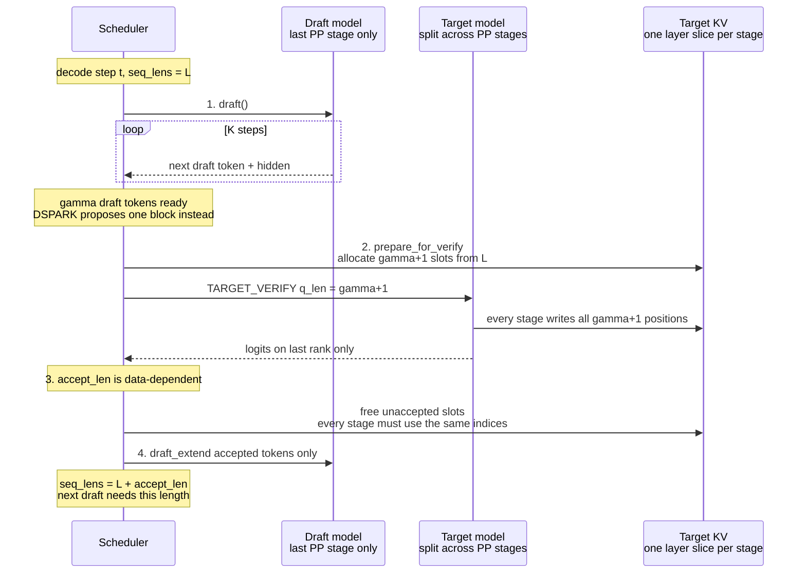
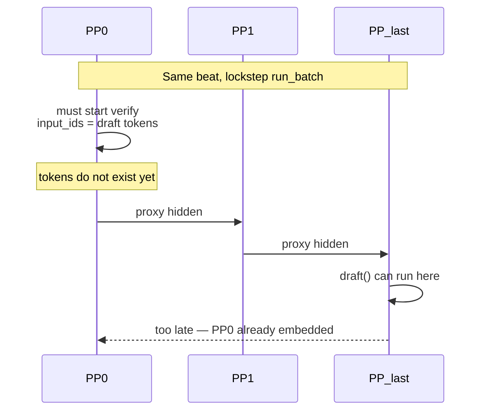
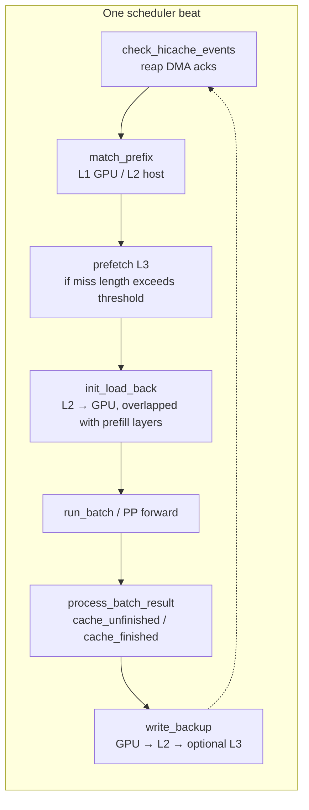

Pipeline parallelism (PP), [hierarchical KV caching (HiCache)](./hicache), and [speculative decoding](./speculative_decoding) all help long-context serving, but they overlap different work and commit KV at different times. This page walks through those timelines, explains the startup guards, and maps what you can combine on Kimi, DeepSeek, and GLM recipes.

Related pages: [Pipeline parallelism](./pipeline_parallelism) · [HiCache design](./hicache_design) · [Speculative decoding](./speculative_decoding) · [Decode context parallelism](./dcp)

## What you can combine today

Startup rejects some combinations outright. Others run, but the cookbook generators drop flags so you do not hit those guards.

| Feature A | Feature B | Result |
| --- | --- | --- |
| PP (`pp_size > 1`) | HiCache L1/L2 or L3 | Supported. CI covers MHA (Llama / Qwen), not DSA or hybrid KDA. |
| PP | Any speculative algorithm (EAGLE / MTP, DSPARK, DFLASH, …) | Startup fails. Overlap schedule is also forced off. |
| PP | DSA cache layer-split | Startup fails. Layer-split needs prefill CP; CP+PP is not validated. |
| HiCache L3 | DCP (`dcp_size > 1`) | Startup fails. L3 keys are not `dcp_rank`-aware. |
| HiCache L1/L2 | DCP + DSPARK | Allowed for MLA. EAGLE/MTP under DCP+HiCache fails. |
| HiCache | PD decode + DCP | Startup fails. Decode DCP stays on chunk cache. |
| HiCache | `--disable-radix-cache` | Mutually exclusive. |

Practical recipe split:

- **Deep PP for prefill capacity** (Kimi-K3 long-context, NPU GLM): no speculative decoding. HiCache L2 can stack; L3 needs Mooncake and per-stage keys.
- **Speculative decoding for decode latency** (DSPARK / MTP): `pp_size == 1`. Flatten PP into TP if you still have the same GPU count.

## Three kinds of overlap

Do not treat these as one “overlap” switch. They hide different stalls:

| Mechanism | What overlaps | Unit of work |
| --- | --- | --- |
| PP microbatch pipeline | Different request groups on different layer stages | One target forward + one sampled token |
| Overlap scheduler | CPU result processing of batch *N* with GPU of batch *N+1* | One `run_batch` (for spec that includes draft + verify + extend) |
| Two-batch overlap (TBO) | Two µbatches inside one forward | Unrelated to PP |

PP disables the overlap scheduler (`disable_overlap_schedule=True`). Its own overlap lives in `event_loop_pp`: `pp_loop_size = pp_size + pp_async_batch_depth` slots, each holding a **fixed group of requests**.

## Pipeline parallelism timeline

Each PP stage owns a slice of **target** layers. Hidden states (`PPProxyTensors`) move forward; sampled token ids move back on the output ring.

With `pp_size=4` and `pp_async_batch_depth=0`, four microbatches (different requests) keep the pipe full:

```mermaid
gantt
    title PP decode: four microbatches fill four stages
    dateFormat X
    axisFormat %s
    section PP0 embed + early layers
    MB0 step t   : 0, 1
    MB1 step t   : 1, 2
    MB2 step t   : 2, 3
    MB3 step t   : 3, 4
    MB0 step t+1 : 4, 5
    section PP1
    MB0 step t   : 1, 2
    MB1 step t   : 2, 3
    MB2 step t   : 3, 4
    MB3 step t   : 4, 5
    section PP2
    MB0 step t   : 2, 3
    MB1 step t   : 3, 4
    MB2 step t   : 4, 5
    MB3 step t   : 5, 6
    section PP3 lm_head + sample 1 token
    MB0 step t   : 3, 4
    MB1 step t   : 4, 5
    MB2 step t   : 5, 6
    MB3 step t   : 6, 7
```



The next decode **for the same slot** waits until that token returns to PP0. Throughput comes from **other slots** occupying other stages, not from overlapping step *t* and *t+1* of the same requests.

One beat of `event_loop_pp`:

```text
recv requests / recv previous-stage hidden (PPProxyTensors)
run_batch                 ← one target forward on this stage's layers
process previous beat     ← CPU, overlapped with current GPU
send hidden to next stage
last rank: sample 1 next_token_id and send it around the output ring
```

That contract is narrow:

- PP0 already knows the input (the previous round's single token).
- Every stage runs **one** target forward.
- Only the last rank has logits and samples **one** token.
- `seq_lens` grows by exactly 1. Every stage writes that one KV slot. There is nothing to roll back.

`--pp-async-batch-depth` only hides last-rank D2H / CPU. It does not launch the same slot's next decode before that token is known.

## Speculative decoding timeline

EAGLE / MTP (DeepSeek V3, GLM-5.x) runs **three** forwards per decode step, in order, inside one `run_batch`:



DSPARK (Kimi-K3, DeepSeek V4) collapses the K draft steps into one `propose()`, then follows the same verify / accept / hidden-inject skeleton.

Differences from PP's unit of work:

1. One decode step is not one target forward. Draft and draft-extend run on **another set of weights**.
2. Verify `q_len` is `gamma+1`, not 1. PP decode CUDA graphs are captured at `q_len=1`.
3. `accept_len` is data-dependent and known only after last-rank logits. Every stage has already written the full verify window.
4. The next step's `seq_lens` depends on that accept. The overlap scheduler publishes `new_seq_lens` **between** verify and draft-extend (`on_publish`). PP's next beat is already a **different slot**.

## Why PP rejects speculative decoding

The guard is global: `pp_size > 1` requires `speculative_algorithm is None`. DSPARK and DFLASH repeat `pp_size == 1` on their own hooks. EAGLE is not an exception.

### Draft on the last stage is necessary, not sufficient

Prefill already builds the draft worker on the last stage only:

```text
non-last ranks: target prefill, then return
last rank:      target prefill, then draft_extend_for_prefill
output ring:    next_token_ids + draft_topk_p / hidden (for PD)
```

Decode still runs `draft() → verify() → draft_extend()` in **one** `run_batch`. PP0 is the **first** rank to enter `run_batch`. It must embed the verify tokens, but those tokens are produced by `draft()` on the last stage, which has not run yet.



Draft tokens travel **last → first**. Verify hidden travels **first → last**. Putting both in one `run_batch` reverses causality on PP.

### The protocol that would work

Keep draft on the last stage, and **split spec across two PP beats**:

```text
Non-PP today:   [ draft | verify | extend ]   ← one run_batch

PP would need:  previous beat, last rank:  verify tail + accept + extend + draft
                next beat, all ranks:      verify only, using the proposal from the ring
```



```mermaid
gantt
    title Same request group: last-stage draft must span two beats
    dateFormat X
    axisFormat %s
    section PP0
    verify t      : 1, 2
    verify t+1    : 5, 6
    section PP1
    verify t      : 2, 3
    verify t+1    : 6, 7
    section PP_last
    verify t      : 3, 4
    accept+extend+draft t : 4, 5
    verify t+1    : 7, 8
    accept+extend+draft t+1 : 8, 9
```

That is a scheduler/protocol change, not a placement change. It also needs:

- Non-last ranks must not call `draft()` on the decode path (today they would crash: no `if self._draft_worker is None` there).
- The output ring must carry `accept_lens`, accepted token ids, and the next proposal — not a single `next_token_id`.
- The same slot's next verify must start **after** every rank has trimmed `gamma+1-k` KV slots. `--pp-async-batch-depth > 0` launches the next GPU beat before that CPU trim. Spec's `seq_lens += accept_len` is data-dependent, so async depth has to stay 0 and last-rank hiding goes away.
- Every stage needs verify-shaped CUDA graphs (`q_len=gamma+1`).
- DSPARK's target verify still has no `pp_proxy_tensors` argument, so hidden cannot cross stages even if `propose()` sits on the last rank.
- Hybrid models (Kimi KDA, GLM-5.3-Flash) must roll back `prepare_mamba_track_for_verify` slots on **every** rank.

Last-rank draft also lengthens the straggler the async-depth knob was meant to hide. Deep PP (TP1 × PP8/16) wants P2P to cover the next **other** microbatch. Spec turns that tail into work for the **same** slot's next verify, which other stages cannot fill.

That is why the cookbooks choose: Deep PP → no spec; DSPARK/MTP → flatten PP into TP.

## HiCache timeline

HiCache is not inside the model forward. Reads happen around scheduling; writes happen after tokens are committed to the radix tree.



**Read path** (before or while a request is waiting):

| When | Action | Payload |
| --- | --- | --- |
| `match_prefix` | Metadata only | Token prefix → L1 / L2 pages |
| L3 prefetch | After local miss, if L3 hit length exceeds threshold | Whole pages. MLA backups one replica; MHA shards by TP rank |
| `init_load_back` | H2D, overlapped with later prefill layers | Host-hit pages for this request |
| Hybrid (Kimi-K3, GLM-5.3-Flash) | Same tree, two pools | Paged MLA KV **and** KDA / mamba state |

**Write path** (after `process_batch_result` treats tokens as final):

| Policy | GPU → L2 | L2 → L3 |
| --- | --- | --- |
| `write_through` | On insert / hit | After DMA ack (`write_backup_storage`) |
| `write_through_selective` | After `hit_count` crosses the threshold | Same |
| `write_back` | On L1 eviction | Same |

Writes use radix **node** device indices, not the speculative verify window. Backed-up nodes must form a contiguous prefix from the root.

Under PP, `check_hicache_events` lets PP0 count ready write/load acks, then `_pp_sync` broadcasts that count down the pipeline. Prefetch stop decisions use the same PP0-leads pattern.

### Why spec plus delayed PP completion can poison L2/L3

Non-spec PP decode: last rank samples one token → every stage appends one KV slot → later `cache_unfinished_req` inserts that token → `write_backup` may copy it to host. The written token is real.

Spec + HiCache must insert **only the accepted prefix**. Otherwise the next request reuses wrong KV.

```text
PP stages:   [ verify writes gamma+1 KV slots ]  [ accept_len not yet known ]
HiCache:            must not cache_unfinished / write_backup yet
Last rank:   [ logits ] [ accept_len = k ] [ broadcast k ] [ all ranks free gamma+1-k ]
HiCache:                                          insert k tokens only
Last rank:                                        draft_extend k tokens
```

The overlap scheduler keeps verify and radix insert in the same `run_batch` / following `process_batch_result`, with `accept_len` in between. PP postpones `process_batch_result` to the next beat and overlaps it with **another** microbatch's GPU. Without “broadcast accept_len → trim KV everywhere → then allow radix insert”, HiCache can write unaccepted tokens.

Hybrid models are stricter: KDA / mamba state is **one track per request**, not one page per token. `prepare_mamba_track_for_verify` takes extra slots that must be released after accept. Backing those slots up as a stable prefix desynchronizes L2 mamba state from MLA KV length.

## DCP versus HiCache

[DCP](./dcp) stripes MLA KV by token position (`p mod c = r`). HiCache L3 MLA backup historically writes **rank 0 only** and omits `dcp_rank` from the key. Under DCP every rank holds a different shard, so that path is rejected.

L1/L2 under DCP is implemented for MLA (host-pool index translation) and only with no spec or DSPARK. EAGLE/MTP draft host pools have no DCP translation.

Kimi-K3's Playground therefore **strips DCP** rather than failing:

| HiCache | Spec | DCP recipe |
| --- | --- | --- |
| Off | any | DCP kept |
| L1+L2 | NOSPEC | DCP kept |
| L1+L2 | DSPARK | DCP dropped |
| L3 | any | DCP dropped |

Only DCP is dropped. B200 Unified can keep `--pp-size 2` / EP. MLA KV becomes TP-replicated again, so per-request context shrinks.

## Model family notes

### Kimi-K3 (MLA + KDA)

- Prefill Deep PP: `--tp-size 1 --pp-size 8` or `16`. DSPARK requires `pp_size == 1`, so those cells stay NOSPEC.
- B200 Unified: `--pp-size 2`. DSPARK flattens that to TP16 (`specCollapsePp`).
- HiCache must offload paged MLA KV **and** KDA state.
- NPU HiCache does not support mamba/KDA state; HiCache is disabled on Atlas.
- PD: decode `pp_size` must equal prefill `pp_size` or 1. A PP16 prefill cannot pair with a PP2 decode.

Deep PP + DSPARK + DCP + HiCache L3 cannot all stand. Any two of those already collide.

### DeepSeek V3 / V3.2 / V4

- V3 / R1: EAGLE MTP. MTP and PP are mutually exclusive. HiCache without DCP is fine. DCP + HiCache + EAGLE fails.
- V3.2 DSA: Hopper cookbook has **prefill CP + PP + EP without MTP**. `--enable-dsa-cache-layer-split` still rejects PP.
- V4: DSPARK needs CUDA, `pp_size == 1`, and is not compatible with PD on current releases. DP attention with `dp_size > 1` is tightly constrained. PD decode DCP + HiCache fails.

### GLM-5.x / GLM-5.3-Flash

- GLM-4.5 / 5 / 5.1 / 5.2: DSA + EAGLE MTP. Same PP and layer-split limits as DeepSeek V3.2. HiCache recipes are TP8 + MTP, no PP. NPU capacity recipes use `--pp-size 4/8` and are NOSPEC.
- GLM-5.3-Flash: hybrid MLA + DSA + KDA, Adaptive MTP (EAGLE). DCP4 is validated on 4×GB300 with MTP and HiCache **off**. Turning DCP and HiCache on together hits the “HiCache+DCP only allows DSPARK” guard because the draft is EAGLE, not DSPARK.

## Code and tests

| Area | Where |
| --- | --- |
| PP rejects spec and overlap | `python/sglang/srt/arg_groups/validation_hook.py` |
| Auto-disable overlap under PP | `python/sglang/srt/arg_groups/overrides.py` (`_pipeline_parallel_overlap_disable`) |
| DSPARK / DFLASH `pp_size == 1` | `python/sglang/srt/arg_groups/speculative_hook.py` |
| HiCache + DCP guards | `python/sglang/srt/arg_groups/hicache_hook.py` |
| PP event loop | `python/sglang/srt/managers/scheduler_pp_mixin.py` |
| Last-stage-only draft (prefill) | `python/sglang/srt/speculative/eagle_worker_v2.py` |
| HiCache PP sync | `python/sglang/srt/mem_cache/hiradix_cache.py` (`_pp_sync`, `_all_reduce`) |
| PP + HiCache CI (MHA) | `test/registered/hicache/test_pp_with_hicache.py`, `test/registered/radix_cache/unified_radix_tree/test_unified_radix_cache_hicache_pp_kl.py` |
