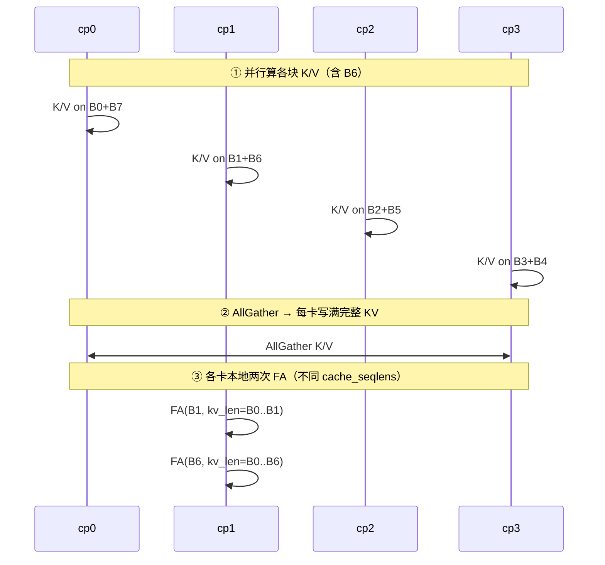
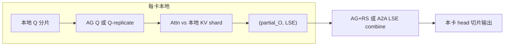

# CP / DCP 技术调研（SGLang vs vLLM）

本文基于当前 SGLang 代码树（`python/sglang/srt/layers/{cp,dcp}/`、attention backend、mem_cache、parallel_state）与公开的 vLLM DCP 设计（blog / docs / PR），梳理 **Prefill Context Parallelism（CP）** 与 **Decode Context Parallelism（DCP）** 的动机、并行组布局、KV 处理、通信路径，以及两边引擎的异同。

> **术语约定**
>
> | 名称 | SGLang CLI | vLLM CLI | 作用阶段 |
> |---|---|---|---|
> | Prefill CP | `--enable-prefill-cp` + `--attn-cp-size` + `--cp-strategy` | `--prefill-context-parallel-size` / `-pcp` | Prefill / Extend |
> | Decode CP (DCP) | `--dcp-size` / `--decode-context-parallel-size` | `--decode-context-parallel-size` / `-dcp` | Decode（SGLang Triton 路径也覆盖 MHA extend） |

两者**不是**同一套抽象：CP 沿序列把 **Q/hidden** 分到不同 rank 做并行 prefill；DCP 沿序列把 **KV cache** 交错分片，用来消除 TP 下的 KV 复制。

**阅读指引（易混点）：**

- Prefill CP 默认 **每卡物化完整 KV**；因果靠 `cache_seqlens`，**不是** rank 串行等 B0→B6（见 [§4.2](#42-zigzag原-in-seq-split) / [§9.1](#91-prefill-cp每卡是否保留完整-kvattention-怎么并行)）。
- DCP 各 rank KV **故意不同**；靠 Pass-Q + LSE merge 还原正确 attention（见 [§3](#3-decode-context-parallelismdcp深度解析) / [§9.2](#92-dcp交错分片后各-rank-kv不一样是否有问题)）。
- `attn_tp = tp/(attn_dp·attn_cp)`，开 CP **会缩小** attn_tp，满配时才为 1；CP Decode Attn TP ≠ DCP（见 [§4.4](#44-cp-decode-attention-tp附属优化)）。

---

## 1. 为什么需要 CP / DCP

### 1.1 TP 下的 KV 复制天花板

标准 Tensor Parallel 按 **attention head** 切分权重与 KV。当：

- **GQA**：`tp_size > num_kv_heads` 时，多余的 TP rank 只能复制同一套 KV head；
- **MLA**（DeepSeek / Kimi 等）：latent KV 实质只有 **1 个 head**，纯 TP **完全无法**按 head 缩小 KV，整份 latent 在每个 TP rank 上复制。

结果是长上下文下每卡 KV 占满，并发被卡住。vLLM blog（2026-08）在 8×B200 / Kimi K2.6 上给出量级：基线 TP 在 concurrency≈64 触顶；DCP 可把每卡 KV 降到约 `1/N`，concurrency 推到 512 量级并抬高 tok/s/GPU。

### 1.2 Prefill 与 Decode 的不同瓶颈

| 阶段 | 计算特征 | 并行诉求 |
|---|---|---|
| Prefill / Extend | 长序列 × 大激活，算力与激活通信并重 | 把序列分到多卡（Prefill CP / Ring / Ulysses） |
| Decode | 每步 Q 极短、KV 极长；内存与带宽主导 | 把 KV 分到多卡（DCP / Helix） |

SGLang 将这两类问题拆成两套子系统（`layers/cp` vs `layers/dcp`），metadata 也分开（`attn_cp_metadata` vs `attn_dcp_metadata`）。

---

## 2. 并行组与进程布局

代码入口：`python/sglang/srt/distributed/parallel_state.py` → `initialize_model_parallel`。

### 2.1 约束关系

```
world_size = tp_size * pp_size   （DP 另计）

# DCP
tp_size % dcp_size == 0
dcp_size >= 1
# DCP 不增加进程数：复用 TP ranks 的子集

# Prefill CP
attn_tp_size = tp_size / (attn_cp_size * attn_dp_size)
tp_size % attn_cp_size == 0
tp_size % (dp_size * attn_cp_size) == 0
```

含义：

- **DCP**：在每个 TP group 内部切 contiguous 子组；**不改变** attn 权重的 head 切分方式（`attn_tp` 与 DCP 无关）。
- **Prefill CP**：把原来的 TP 预算再拆成 `attn_tp × attn_cp (× attn_dp)`，**缩小有效 attn_tp**。同一组 GPU 在「按 head 切权重」与「按序列并行」之间分配：
  - `tp=8, attn_cp=2` → `attn_tp=4`
  - `tp=8, attn_cp=8` → `attn_tp=1`（attention 权重复制到每张 CP 卡）
  - Attention 线性层用 `attn_tp_size`（如 `num_local_heads = num_heads // attn_tp_size`），不是裸 `tp_size`。

### 2.2 DCP 组构造

```python
# tp_size=8, dcp_size=4 → 两组 DCP
# [g0,g1,g2,g3], [g4,g5,g6,g7]
for tp_group in group_ranks:
    for start in range(0, len(tp_group), dcp_size):
        dcp_group_ranks.append(tp_group[start : start + dcp_size])
```

- `dcp_size == 1` 时 `_DCP = None`，runtime 侧 `dcp_enabled=False`，`attn_dcp_size=1`。
- ModelRunner 常用 `dcp_rank = tp_rank % dcp_size`。

### 2.3 Prefill CP 组构造（示例）

文档注释（`parallel_state.py`）：`attn_cp=2`、`attn_tp=4` 时：

```
TP groups:     [g0..g3], [g4..g7]
Attn CP:       [g0,g4], [g1,g5], [g2,g6], [g3,g7]
```

CP 组内做 hidden / KV 的 all-gather；同组不同 CP rank 持有序列不同分段。

### 2.4 CLI 一览（SGLang）

| 参数 | 默认 | 说明 |
|---|---|---|
| `--dcp-size` | 1 | Decode KV 序列分片度 |
| `--dcp-comm-backend` | `ag_rs` | `ag_rs` / `a2a` / `fi_a2a` |
| `--dcp-replicate-q-proj` | 模型相关 | MLA a2a 路径可跳过每层 Q AG |
| `--enable-prefill-cp` | False | 打开 Prefill CP |
| `--attn-cp-size` | 1 | Prefill CP 组大小 |
| `--cp-strategy` | None | `zigzag` / `interleave` |
| `--enable-cp-decode-attn-tp` | False | Prefill CP 使 `attn_tp` 变小/为 1 后，decode 临时按 CP rank 切复制权重（**不是 DCP**） |

平台校验要点（`_handle_dcp_validation`）：

- HIP 上 DCP 较成熟；CUDA 上需特定模型/后端；
- CUDA + speculative 目前仅白名单：Kimi Linear + DSPARK + decode-mode + `tokenspeed_mla`/`cutedsl_mla`（且 `SGLANG_RAGGED_VERIFY_MODE=static`）；
- `fi_a2a` 需要 CUDA + MNNVL fabric（如 GB200 NVL72）；
- Unified memory pool **拒绝** `dcp_size > 1`。

---

## 3. Decode Context Parallelism（DCP）深度解析

### 3.1 核心思想：交错 KV 所有权

**Owner rule**（`layers/dcp/layout.py`）：

```
绝对位置 p 由 rank (p % dcp_size) 持有
物理 slot = virtual_loc // dcp_size
```

局部可见长度：

```
local_len = len // dcp_size + (rank < len % dcp_size)   # start=0
```

带 prefix `start` 偏移时由 `get_dcp_lens(lens, dcp_size, dcp_rank, start)` 统一计算。

**例子**（`dcp_size=4`，序列长 10）：

| Rank | 持有绝对位置 |
|---|---|
| 0 | 0, 4, 8 |
| 1 | 1, 5, 9 |
| 2 | 2, 6 |
| 3 | 3, 7 |

交错而非 contiguous chunk，是为了 **decode 时新 token 自然落到正确 rank**，无需重平衡。

这与 Moonshot 在 vLLM #23734 引入的策略、Helix Parallelism（arXiv:2507.07120）一致。

### 3.2 虚拟索引 vs 物理池

| 概念 | 行为 |
|---|---|
| 物理 KV pool | 容量仍按本卡 `max_total_num_tokens` 分配（只存本 rank 的 shard） |
| Allocator | `PagedTokenToKVPoolAllocator(size=max_tokens * dcp_size, page_size=page_size * dcp_size)` |
| `req_to_token` | 存 **虚拟 index**；kernel 用 `// dcp_size` + `% dcp_size` 过滤 |
| Radix / TreeCache | `page_size` 强制对齐到 `allocator.page_size`，避免 eviction 冲突 |

效果：同样物理显存下，逻辑上可服务约 **`dcp_size` 倍** 的总 token 容量（每序列每卡只存 `1/dcp_size`）。

写入路径：

- **MHA（Triton）**：`loc = out_cache_loc // dcp_size`，`dcp_kv_mask = (positions % dcp_size == dcp_rank)`；
- **MLA**：`valid_mask = loc % attn_dcp_size == attn_dcp_rank`（`memory_pool.py`）。

### 3.3 Decode 计算流水线（Pass-Q）

```
┌─────────────┐     ┌──────────────────────┐     ┌─────────────────────┐
│ AllGather Q │ ──► │ Attn(Q_full, KV_local)│ ──► │ Merge partial + LSE │
│ (或 Q 复制) │     │  return (out, LSE)    │     │ ag_rs / a2a / fi_a2a│
└─────────────┘     └──────────────────────┘     └─────────────────────┘
```

1. **Q 侧**：默认在 DCP 组上 all-gather 完整 query（decode 时 Q 只有 1 token，通信量小）。`--dcp-replicate-q-proj` 可在加载时复制 Q 投影权重，让每 rank 本地算全 head，省掉每层 Q AG（对齐 vLLM `VLLM_DCP_Q_REPLICATE` / #45964）。
2. **Attn**：每 rank 用完整 Q 对 **本地 KV shard** 做 attention，并返回 LSE（online softmax 所需）。
3. **Merge**：把各 rank 的 partial output 按 LSE 加权合成，再恢复本 rank 的 head 切片。

通信体积对 merge 而言是 **O(B × H × D)**，**与 KV 长度无关**——这是 DCP 相对 Ring Attention 在 decode 场景的关键优势。

### 3.4 三种通信后端（`--dcp-comm-backend`）

实现：`python/sglang/srt/layers/dcp/comm.py`。

#### 3.4.1 `ag_rs`（默认）

| 路径 | 合并函数 | 细节 |
|---|---|---|
| MLA | `cp_lse_ag_out_rs_mla` | AG LSE → Triton `correct_attn_out`（log2/exp2）→ **reduce-scatter** 沿 head |
| MHA | `cp_lse_ag_out_rs_mha` | AG LSE → `exp(lse - global_lse)` 缩放 → **all-reduce** → 按 rank 切 head |

MLA 伪代码：

```python
lses = cp_group.all_gather(cp_attn_lse)          # [N, B, H]
out = correct_attn_out(cp_attn_out, lses, rank)  # 本地 LSE 校正
out = cp_group.reduce_scatter_along_dim(out, 0)  # 收回本 rank heads
```

MHA 伪代码：

```python
global_lse = logsumexp(all_gather(lse), dim=0)
out = all_reduce(out * exp(local_lse - global_lse))
out = out[:, head_start:head_end]  # 切片
```

#### 3.4.2 `a2a`（Helix 风格 packed All-to-All）

引入：SGLang #21637（对齐 vLLM #34883 / #41160）。

```
cp_attn_out [B, H, D]  → reshape [N, B, H/N, D]
cp_attn_lse [B, H]     → reshape [N, B, H/N]
pack LSE 为 output dtype 的额外列（bf16/fp16 时 lpd=2）
→ 单次 all_to_all_single（uint8 字节传输，兼容 fp8）
→ dcp_lse_combine_triton 本地加权合成
```

约束：`num_heads % dcp_size == 0`。

收益：

- 把原先「AG LSE + RS/AR」合成 **1 次** 平衡的 A2A；
- 通信量同阶，但 collective 次数与尾延迟更优；
- CUDA graph 路径预分配 `send_combined` / `recv_combined` buffer。

#### 3.4.3 `fi_a2a`（FlashInfer MNNVL）

依赖 FlashInfer #2951：`flashinfer.comm.dcp_alltoall`。

- 进程启动时 `init_fi_a2a_workspace`（**必须在 CUDA graph capture 之前**，含 barrier）；
- 交换布局：`partial_o [B, H_per_rank, cp_size, D]` + `softmax_stats [B, H_per_rank, cp_size, 2]`；
- 本地仍复用 `dcp_lse_combine_triton`；
- 仅 MNNVL fabric（如 GB200）；小消息上相对 NCCL A2A 可有数倍延迟收益（FlashInfer 报告量级）。

### 3.5 Extend / Prefill 在 DCP 下的特殊处理

Decode 交错写 KV 后，extend 若仍只看本地 shard，会缺 prefix。SGLang 选择：

1. 用 `prepare_decode_context_parallel_metadata` 建 `DecodeContextParallelMetadata`：
   - `dcp_local_prefix_kv_indices`：本 rank 持有的 prefix 物理 index；
   - `dcp_kv_buffer`：临时全量 buffer（prefix gather 后 + 本段 extend）；
   - `dcp_kv_indices` / `dcp_kv_indptr`：指向 buffer 的索引。
2. `all_gather_kv_cache_for_dcp`：按交错规则 pad → AG → 按 query 顺序重排。
3. MLA：`all_gather_kv_cache_for_mla_extend` 写入 `dcp_kv_buffer`；MHA chunked：`all_gather_kv_cache_for_mha_*`。

代价：extend 时会临时 **物化完整 prefix KV**（相对 decode 路径更贵）。这是「decode 省显存」与「extend 正确性」之间的折中；Prefill CP 则用另一套策略避免在 prefill 全程依赖 DCP 的 AG-KV。

### 3.6 Attention Backend 覆盖面（SGLang）

| Backend | DCP 角色 |
|---|---|
| Triton MHA | 完整 decode + extend（AG+RS MHA 合并） |
| FlashInfer-MLA / FlashMLA / TokenSpeed / CuteDSL / TRTLLM-MLA | 经 `forward_mla.py` 统一 Q AG / LSE merge |
| FlashAttention（FA3/FA4） | **Prefill CP**，不是 DCP |
| DSA + Interleave CP | Prefill CP（round-robin），不是 DCP |

`plan_dcp_decode_metadata`：decode 时把全局 `kv_lens/indptr/indices` 压成本地 owned slots（`update_kv_lens_and_indices` Triton kernel）。

### 3.7 关键 Kernel（`kernels/ops/attention/dcp_kernels.py`）

| Kernel / API | 用途 |
|---|---|
| `create_triton_kv_indices_for_dcp_triton` | MHA：`abs_pos = first + i*dcp_size`，store `data // dcp_size` |
| `create_mla_kv_page_table_for_dcp` | MLA paged page table |
| `create_dcp_kv_indices` | MLA extend：gathered buffer 内的 prefix+extend 布局 |
| `update_kv_lens_and_indices` | Decode：收集 owned slots |
| `correct_attn_out` / `_correct_attn_cp_out_kernel` | AG+RS MLA LSE 校正 |
| `dcp_lse_combine_triton` | A2A 路径本地 LSE 加权（支持 base-e / base-2） |

---

## 4. Prefill Context Parallelism（CP）深度解析

### 4.1 Strategy 抽象（CP-v2）

`python/sglang/srt/layers/cp/`：

```
ContextParallelStrategy (ABC)
├── ZigzagCPStrategy      # --cp-strategy zigzag
└── InterleaveCPStrategy  # --cp-strategy interleave
```

统一接口：`build_metadata` / `shard_hidden_states` / `shard_position_ids` / `gather_hidden_states` / `gather_kv_cache` / `run_attention` / `materialize_full_kv` / `materialize_full_mla_kv`。

进程级单例：`init_cp_strategy(server_args)`；worker 子进程可 lazy 恢复。

### 4.2 Zigzag（原 in-seq-split）

`cp_size=4` 时每条序列切成 `2 * cp_size = 8` 块：

```
cp0: block0, block7
cp1: block1, block6
cp2: block2, block5
cp3: block3, block4
```

目的：因果 mask 下每个 rank 的 **early + late** 块负载更均衡（类似 Megatron / Ring Attention 的 zigzag 负载均衡）。

**一层内的真实顺序（关键）：**

```
① 各 rank 并行投影自己的两块 → 得到 local Q/K/V
② AllGather K/V + 重排 → 每卡 pool 写入完整序 [B0|…|B7]
③ 本卡对本地 Q 跑 Attention（读已完整的 pool）
```

因此 **B6 不必等 B0–B5 串行算完**：B0–B5 的 K/V 在 ① 已由各卡并行算出，② gather 齐后再做 ③。因果只约束「读哪些 KV」，不约束「谁先算完」。

**为什么两次 FA：** 本 rank 的 early / late 两段 Q 合法前缀长度不同（如 B1 只看到 B0..B1，B6 看到 B0..B6），而 FA 一次只能带一个 `cache_seqlens`，故 `run_attention` 拆成 `q_prev` / `q_next` 两次再 cat。详见 [§9.1](#91-prefill-cp每卡是否保留完整-kvattention-怎么并行)。

通信：

- 层间 / 末层：`all_gather_into_tensor`（pad 到 `max_rank_len`）→ 按 `cp_reverse_index` 重排回全局 token 序；
- KV 物化：`gather_kv_cache` 后 `set_kv_buffer` / `set_mla_kv_buffer` 写回**完整序** KV（供后续 decode / 非 CP 路径使用）。

支持后端：FlashAttention、TRTLLM_MHA。

### 4.3 Interleave（原 round-robin-split）

```
cp0: token0,4,8,...
cp1: token1,5,9,...
cp2: token2,6,10,...
cp3: token3,7,11,...
```

与 DCP 的 owner 规则同构，但这里分的是 **prefill 计算 token**，不是「只存本地 KV」。

DSA 路径专用：`run_attention` 为空（DSA 自己跑 attention）；提供：

- `shard_per_request`（`dsa_cp_round_robin_split_q_seqs_kernel`）；
- `materialize_full_indexer_k_cache`；
- `all_gather_dsa_trtllm_fp8_kv`（FP8 用 uint8 视图 gather）。

Gather：AG padded → `index_select` 按 `(flat % cp) * physical_len + flat // cp` 还原。

### 4.4 CP Decode Attention TP（附属优化）

**≠ DCP，不改 KV。** 解决的是 Prefill CP 把 GPU 预算挪给 `attn_cp` 之后、decode 阶段的算力浪费。

回顾：`attn_tp = tp / (attn_dp · attn_cp)`。满配（如 `tp=8, attn_cp=8`）时 `attn_tp=1`，attention 权重在每张 CP 卡上 **整份复制**——prefill 时合理（各算各的序列块、需要全 head）。Decode 不再走 zigzag/interleave 后，若仍用整份权重，多卡会重复做同一套全 head GEMM。

`--enable-cp-decode-attn-tp`：在 decode forward 的 context manager 里按 `attn_cp_rank` **临时切片** Column/RowParallel 权重（伪 TP），RowParallel 走 all-reduce；结束 restore，留给下次 prefill。Prefill CP 活跃时强制不切。白名单：DeepSeek-V4 / GLM DSA 等（`CP_DECODE_ATTN_TP_SUPPORTED_ARCHS`）。详见 [§9.5](#95-cp-decode-attention-tp-是什么)。

### 4.5 Prefill CP 与 DCP 能否同开

Server args **没有**硬性互斥，但 **KV 布局哲学相反**，默认不要当成可随意叠加的组合：

| | Prefill CP（默认） | DCP |
|---|---|---|
| Group | `_ATTN_CP` | `_DCP` ⊂ TP |
| Metadata | `attn_cp_metadata` | `attn_dcp_metadata` |
| 池里 KV | **完整序**（每卡一份，按 attn_tp 切 head） | **仅交错 shard**（`pos % N`） |
| 主战场 | FA / DSA prefill | Triton MHA / MLA decode |

`dcp_kv_buffer` 是 **DCP extend 自己的临时完整视图**（本地 shard AG 上来算 prefix），不是 Prefill CP 组件；仅开 DCP 时 extend 就会用到。详见 [§9.3](#93-prefill-cp-与-dcp-能否共用要不要-global_kv_buffer)。

实践：超长 prefill 用 CP；高并发长上下文 decode / MLA 用 DCP。同开需布局转换或统一写入规则；另需小心 PD disagg / HiCache（L3 key 尚不感知 `dcp_rank`）。

---

## 5. 与 vLLM 的对比

### 5.1 算法族：同源

两边 DCP 同属 **Helix / Moonshot interleaved KV + Pass-Q + LSE merge** 一族：

| 维度 | SGLang | vLLM |
|---|---|---|
| KV 分片 | `pos % dcp_size` | 同（#23734）；另有 `--cp-kv-cache-interleave-size` 可按 block 交错 |
| 进程模型 | 不扩 world，复用 TP | 同；有 PCP 时 DCP 可跨 PCP 轴 |
| Decode 节奏 | AG Q → local attn → merge | 同（blog 称 AllGather Q → Compute → AG+RS） |
| Q 复制 | `--dcp-replicate-q-proj` | `VLLM_DCP_Q_REPLICATE` / #45964 |
| A2A | `#21637` packed out+LSE | `#34883` → `#41160` pack；`async_op=True` |
| FlashInfer A2A | 显式 `--dcp-comm-backend fi_a2a` | `#48248` 在 Blackwell+full CUDA graph 等条件可自动走 fused |
| Symm-mem A2A | 开放 PR `#33364` `symm_a2a` | `#48897` direct symm A2A |

### 5.2 通信后端对照

| Backend | SGLang | vLLM | NCCL 次数（量级） |
|---|---|---|---|
| AG+RS | 默认 `ag_rs`；MLA 用 RS，MHA 用 AR+slice | 默认 `ag_rs` | 经典路径约 3 次/层（含 Q AG） |
| Packed A2A | `a2a`：1 次 A2A 传 out∥LSE | `a2a`：pack 后类似 | Q AG + 1 A2A |
| FlashInfer MNNVL | 显式 `fi_a2a` | 条件自动 / fused | 专有 LL128 FIFO |
| Direct symm | 进行中 | `VLLM_USE_DIRECT_DCP_A2A` | P2P，避开通用 NCCL |

### 5.3 Prefill 方向差异（重要）

| | SGLang | vLLM |
|---|---|---|
| Prefill 并行 | 一等公民：`--enable-prefill-cp` + zigzag/interleave strategy ABC | `--prefill-context-parallel-size`（PCP），文档强调 **扩 world**；Ring/Ulysses 路线图更重 |
| Zigzag / Interleave | 完整 FA + DSA 实现 | 未以同名 strategy 暴露 |
| Diffusion SP | `multimodal_gen` 另有 Ulysses/Ring degree | 独立 |

经验结论（社区二次分析，需自行验证）：SGLang prefill 长序列更常走 **CP strategy + FA/DSA + AG KV 物化**；vLLM 长 prefill 更偏 **PCP / Ring / Ulysses** 方向。**Decode DCP 两边高度同构。**

### 5.4 产品栈差异（影响落地）

| 主题 | SGLang | vLLM |
|---|---|---|
| 缓存 | Radix / TreeCache；DCP 时 page_size×N | BlockManager / prefix caching |
| HiCache | L3 与 DCP 暂不兼容（key 不感知 dcp_rank） | — |
| Speculative | CUDA 上 DCP+spec 白名单很窄 | 官方 roadmap：更好 MTP/spec |
| PD disagg | 需单独验证 DCP 与 transfer backend | 官方 roadmap hardening |
| MLA 覆盖 | FlashInfer / FlashMLA / TokenSpeed / CuteDSL 等 | FlashMLA 等；部分 FlashInferMLA 与 LSE 有约束历史 |
| GQA/MHA | Triton 路径较完整（#25090） | FlashAttn / FlashInfer 路由 A2A |

### 5.5 配置示例对照

**SGLang MLA DCP（示意）：**

```bash
python -m sglang.launch_server \
  --model-path deepseek-ai/DeepSeek-V3 \
  --tp-size 8 \
  --dcp-size 8 \
  --dcp-comm-backend a2a \
  --dcp-replicate-q-proj
```

**vLLM 等价：**

```bash
vllm serve deepseek-ai/DeepSeek-R1 \
  --tensor-parallel-size 8 \
  --decode-context-parallel-size 8 \
  --dcp-comm-backend a2a
# Q 复制：VLLM_DCP_Q_REPLICATE=1
```

**SGLang Prefill CP（zigzag）：**

```bash
python -m sglang.launch_server \
  --model-path <model> \
  --tp-size 8 \
  --enable-prefill-cp \
  --attn-cp-size 2 \
  --cp-strategy zigzag
```

**GQA DCP 上限提醒（vLLM 文档公式，SGLang 实践同类）：**

```
# 例：num_kv_heads=4, tp=8 → 复制因子 2 → dcp_size ≤ 2
dcp_size ≤ tp_size / num_kv_heads
```

MLA 则可达 `dcp_size == tp_size`。

---

## 6. 通信量与复杂度速查

设：`N = dcp_size`，`B` batch，`H` 本层参与 merge 的 head 数，`D` head dim，`T` 序列长，`E` 单 token KV 字节。

| 操作 | 量级 | 备注 |
|---|---|---|
| Decode AG Q | `O(B · H · D)` | 与 T 无关；可被 Q-replicate 消掉 |
| Decode merge AG+RS / A2A | `O(B · H · D)` | 与 T 无关 |
| 本卡 KV 存储 | `O((T/N) · E)` | DCP 核心收益 |
| Extend AG KV（SGLang） | `O(T · E)` 临时 | prefix 需 gather；decode 稳态不付此价 |
| Prefill CP AG hidden/KV | `O(T · hidden)` | zigzag/interleave gather |
| Ring Attention（对照） | 每层循环传 KV chunk，与 T 相关 | 更适超长 prefill |

Helix 声称：相对基线可降低 TTL、提升并发数量级；A2A 相对 AG+RS 主要减 **collective 次数与尾延迟**，不是数量级通信量砍半。

---

## 7. 代码地图（SGLang）

```
python/sglang/srt/
├── server_args.py                 # CLI / _handle_dcp_validation / _handle_context_parallelism
├── distributed/parallel_state.py  # _DCP / _ATTN_CP 组创建
├── runtime_context.py             # get_parallel().dcp_* / attn_cp_*
├── layers/dcp/
│   ├── comm.py                    # AG+RS / A2A / fi_a2a / KV AG helpers
│   ├── layout.py                  # owner rule / get_dcp_lens
│   ├── planner.py                 # metadata builders
│   └── metadata.py                # DecodeContextParallelMetadata
├── layers/cp/
│   ├── base.py                    # Strategy ABC + singleton
│   ├── zigzag.py                  # ZigzagCPStrategy
│   ├── interleave.py              # InterleaveCPStrategy
│   └── cp_decode_attn_tp.py       # decode 伪 TP 切片
├── layers/attention/triton_backend.py          # MHA DCP
├── models/deepseek_common/.../forward_mla.py   # MLA DCP 编排
├── mem_cache/kv_cache_configurator.py          # allocator × dcp_size
└── kernels/ops/attention/dcp_kernels.py        # Triton kernels

test/registered/dcp/               # 功能 / layout / LSE / 模型 e2e
```

PR 系谱（便于追历史）：

| PR | 内容 |
|---|---|
| SGLang #14194 | MLA DCP（FlashInfer 路径，AG+RS） |
| SGLang #25090 | Triton/MHA DCP（对齐 vLLM Helix RFC #34018） |
| SGLang #21637 | `a2a` / `fi_a2a` / Q-replicate |
| SGLang #33364（开放） | `symm_a2a` |
| vLLM #23734 | 首个 MLA DCP |
| vLLM #34883 / #41160 | A2A + pack |
| vLLM #45964 | Q replicate |
| vLLM #48248 / #48897 | FlashInfer fused / direct symm A2A |
| FlashInfer #2951 | `decode_cp_a2a_*` MNNVL |

---

## 8. 选型建议与已知限制

### 8.1 何时开 DCP

- MLA 模型 + 大 `tp_size`（否则 latent KV 全复制）；
- GQA 且 `tp_size > num_kv_heads`，用多余复制度做序列分片；
- 长上下文、高并发 decode，KV 显存是瓶颈；
- 有高带宽 NVLink / NVL72 时优先尝试 `a2a` / `fi_a2a`。

### 8.2 何时开 Prefill CP

- Prefill/TTFT 被长序列激活卡住；
- Dense+FA → `zigzag`；DSA/NSA → `interleave`；
- 接受 decode 前把 KV gather 成完整序（或配合 CP decode attn TP）。

### 8.3 当前限制（以代码校验为准）

1. DCP 平台/模型矩阵仍不对称（HIP vs CUDA、spec 白名单）。
2. `fi_a2a` 绑定 MNNVL；普通集群用 `a2a` 或默认 `ag_rs`。
3. Unified KV pool、部分 HiCache L3 路径与 DCP 不兼容。
4. Extend 路径的 KV all-gather 会短暂拉高显存与带宽。
5. Prefill CP 与 DCP 同开缺少一等公民集成测试叙事，需 case-by-case。
6. vLLM 侧 PCP 扩 world 与 SGLang `attn_cp` 缩 `attn_tp` 的运维模型不同，迁移配置时不能 1:1 抄参数。

---

## 9. FAQ 深挖（可视化）

### 9.1 Prefill CP：每卡是否保留完整 KV？Attention 怎么并行？

**默认答案：是，每卡写回完整序列序的 KV（本 attn_tp 的 head 分片）。**

Zigzag / 默认 FA 路径在每层算完本地 K/V 后调用 `materialize_full_kv` / `materialize_full_mla_kv`：all-gather → 按原 token 序重排 → `set_kv_buffer`。随后 `run_attention` 用 **本地 Q 分片** 去读 **池里已是完整序的 KV**。

```
序列:  |--B0--|--B1--|--B2--|--B3--|--B4--|--B5--|--B6--|--B7--|   (cp_size=4 → 8 块)

cp0 算 Q/K/V: B0 + B7
cp1 算 Q/K/V: B1 + B6
cp2 算 Q/K/V: B2 + B5
cp3 算 Q/K/V: B3 + B4
```

#### 「B6 不用等 B0–B5 先算完吗？」——不用

把两件事分开：

| | 含义 |
|---|---|
| **因果** | B6 的 query 做 attention 时，只能 **读到** B0…B6 的 K/V |
| **计算顺序** | B0…B7 的 K/V 由各 rank **同一层内并行算出**，再 AllGather；没有「先算完 B0 才能开算 B1」的跨卡流水线 |

一层内真实顺序：

```
① 并行投影（同一时刻）
   cp0 → K/V(B0), K/V(B7)
   cp1 → K/V(B1), K/V(B6)     ← B6 的 K/V 此刻已算出
   cp2 → K/V(B2), K/V(B5)
   cp3 → K/V(B3), K/V(B4)

② AllGather + 重排
   每卡 pool = 完整 [B0|B1|…|B7]
   （B6 要「看见」的 B0–B5，来自别卡 gather 过来，不是等它们串行算完）

③ 再跑 Attention（只读本地 pool）
```

#### 「两次 FA」是什么意思？

每个 zigzag rank 拥有 **两段不相邻** 的 Q（early + late），合法 KV 前缀长度 **不同**。FlashAttention 一次调用只能带 **一个** `cache_seqlens`，所以必须拆两次：

```
例：cp_rank=1 拥有 B1(early) 与 B6(late)

本卡 Q:  [ B1 (=q_prev) | B6 (=q_next) ]

FA #1: q=B1, cache_seqlens = |B0|+|B1|        // 只能看到 B0..B1
FA #2: q=B6, cache_seqlens = |B0|+…+|B6|      // 能看到 B0..B6
→ cat(out1, out2)

KV pool: [B0][B1][B2][B3][B4][B5][B6][B7]
          <- FA1 ->
          <----------- FA2 ----------->
```

两次 FA = **同一卡上两段 Q、两套可见长度**；不是「先全员算完第一段、再算第二段」的跨卡同步。若把 `[B1|B6]` 拼成一次 FA，无法给两段 Q 设不同前缀长度。



**为什么保留完整 KV：** Prefill CP 目标是分摊 Q/FFN 算力，不是省 decode 显存；Zigzag 依赖完整序 KV + 可见长度截断；decode 默认不再走 CP，需要池里已有完整序列。例外：`--enable-dsa-cache-layer-split` 按 layer 切 DSA KV。

---

### 9.2 DCP：交错分片后各 rank KV「不一样」是否有问题？

**不一样是设计目标。** 每卡只存 `pos % N == rank` 的 token，显存降为约 `1/N`。Decode 正确性不靠「每卡 KV 相同」，而靠 **Pass-Q + 分片 Attn + LSE merge**。

#### 为什么用交错而不是「前 T/N / 中 T/N / 后 T/N」？

Decode 每步只新增 **1** 个 token。若按 contiguous chunk：

```
坏例子（contiguous）: rank0 管 [0,T/4), rank1 管 [T/4,T/2), ...
新 token 总是落在「当前末尾」那一个 rank → 该 rank KV 暴涨，其它 rank 空转，且所有权边界要不断重划。
```

交错：

```
好例子（interleaved）: owner(p) = p % 4
新 token t=100 → rank 0；t=101 → rank 1；… 自然轮转，负载长期均衡，无需重平衡。
```

```
绝对位置:  0  1  2  3  4  5  6  7  8  9 10 11
owner:     0  1  2  3  0  1  2  3  0  1  2  3

rank0 物理槽: 存 pos 0,4,8,…   → 物理 index = virtual // 4
rank1 物理槽: 存 pos 1,5,9,…
rank2 物理槽: 存 pos 2,6,10,…
rank3 物理槽: 存 pos 3,7,11,…
```

#### Decode 计算流水（各 rank KV 不同也能得到正确 softmax）

数学直觉：完整 attention 是对 **全部 KV 位置** 做 softmax。把位置集合拆成 N 份后，每份算出局部 `(out_i, lse_i)`，再用 online-softmax / LSE 加权合成全局结果——这是标准的 **分块 attention 归约**，不是「缺 KV 硬算」。

```
Decode 一步（dcp_size=4）:

  每卡本地只有 1 个新 token 的 partial Q（按 TP/head 切过）
       │
       ▼
  ┌─────────────┐
  │ AllGather Q │  （或 --dcp-replicate-q-proj：本地直接算满 head）
  └──────┬──────┘
         │  每卡都有完整 Q
         ▼
  ┌──────────────────────────────────┐
  │ Attn(Q_full, KV_local_shard)     │
  │ 只对「自己拥有的」约 T/N 个 KV 打分 │
  │ 返回 partial_out + LSE           │
  └──────┬───────────────────────────┘
         │
         ▼
  ┌──────────────────────────────────┐
  │ Merge（ag_rs 或 a2a / fi_a2a）    │
  │ 用各 rank 的 LSE 加权合成         │
  │ 并收回本 rank 该持有的 head 切片  │
  └──────────────────────────────────┘

可视化（忽略 head，只看序列分片）:

  Q ──┬──► rank0: score vs KV{0,4,8,…}  → (O0, LSE0) ─┐
      ├──► rank1: score vs KV{1,5,9,…}  → (O1, LSE1) ─┼── LSE-merge → O_full
      ├──► rank2: score vs KV{2,6,10,…} → (O2, LSE2) ─┤
      └──► rank3: score vs KV{3,7,11,…} → (O3, LSE3) ─┘

  各 rank 的 KV 状态确实不同；合并后等价于对全集 KV 做 attention。
```



---

### 9.3 Prefill CP 与 DCP 能否共用？要不要 `global_kv_buffer`？

**KV 布局哲学相反，默认不要当成可随意叠加的组合。**

| | Prefill CP（默认） | DCP |
|---|---|---|
| Prefill/Extend 后池里有什么 | **完整序 KV**（每卡一份，按 attn_tp 切 head） | **仅本地交错 shard** |
| 目标 | 加速 prefill 算力 | 省 decode 显存 / 提并发 |

同开时语义冲突：

- Prefill CP 的 `materialize_full_*` 会把完整序列写入 pool；
- DCP 的写入路径要求 `loc % dcp_size == rank`，物理槽是 `virtual // dcp_size`；
- DCP 的 decode 元数据 / page table 假定交错所有权。

若坚持「prefill 用 CP、decode 用 DCP」，至少需要一次 **布局转换**（完整序 → 交错 shard），或 prefill 阶段就按 DCP owner 规则写 pool（那就不是现在的 zigzag materialize 路径了）。

**关于 `dcp_kv_buffer`：**  
这是 **DCP 自己的 extend/prefill 旁路**，不是 Prefill CP 的东西。DCP 在 extend 时因为本地只有交错 shard，算 prefix attention 前会：

1. 用 `dcp_local_prefix_kv_indices` 取出本卡持有的 prefix；
2. `all_gather_kv_cache_for_*` 填进临时 `attn_dcp_metadata.dcp_kv_buffer`（完整 prefix + 本段 extend）；
3. 用 buffer 上的 indices 做这次 forward 的 attn。

所以：**仅开 DCP 时，extend 本来就会有临时 global buffer（至少逻辑上是完整 KV 视图）**；稳态 decode 不保留它。  
**不是**「为了和 Prefill CP 共用才需要」；反过来，Prefill CP 默认已经在 pool 里留了完整 KV，和 DCP 稳态「只留 1/N」打架。

实务建议：长 prefill 算力不够 → Prefill CP；长上下文 decode 显存不够 → DCP。先选一个主矛盾。

---

### 9.4 Zigzag vs Interleave 区别

| | **Zigzag** | **Interleave** |
|---|---|---|
| 分片图案 | 每序列切 `2×cp_size` 块；rank r 拿 early 块 r + late 块 `2N-1-r` | rank r 拿 `token r, r+N, r+2N, …` |
| 负载意图 | 因果下 early 短可见、late 长可见，配对后各卡 FLOPs 更均 | 均匀抽稀；实现简单，和 DCP owner 同构 |
| Attention | 本策略 `run_attention`：Q 拆 prev/next，两次 FA，依赖 **完整 KV pool** | 主要为 **DSA**；attention 在 DSA 内核内，策略侧 `run_attention` 为空 |
| 典型模型 | Dense MHA/MLA + FlashAttention / TRTLLM_MHA | DeepSeek DSA / NSA 稀疏检索路径 |
| CLI | `--cp-strategy zigzag` | `--cp-strategy interleave` |

```
Zigzag (N=4):     Interleave (N=4):
rank0: B0 + B7    rank0: t0,t4,t8,t12,…
rank1: B1 + B6    rank1: t1,t5,t9,t13,…
rank2: B2 + B5    rank2: t2,t6,t10,t14,…
rank3: B3 + B4    rank3: t3,t7,t11,t15,…
```

Zigzag 多一轮「块配对」是为了缓解因果 attention 下「越靠后的 token 可见 KV 越长」带来的负载倾斜；Interleave 把倾斜打散到每个 rank，但和当前 DSA 实现耦合更深。

---

### 9.5 CP Decode Attention TP 是什么？

它 **不是 DCP**，也 **不改 KV 布局**。它解决 Prefill CP 打开后 decode 阶段的 **算力浪费**。

#### 是不是「prefill 开 CP ⇒ attn_tp=1」？

**不一定，但会变小；满配 CP 时才是 1。** 公式（`dp_attention.py`）：

```
attn_tp_size = tp_size / (attn_dp_size * attn_cp_size)
```

| 配置 | attn_tp |
|---|---|
| `tp=8, attn_cp=1` | 8（纯按 head 切） |
| `tp=8, attn_cp=2` | 4 |
| `tp=8, attn_cp=8` | **1**（权重复制） |

Attention 线性层用 `attn_tp_size` 切 head（如 `num_local_heads = num_heads // attn_tp_size`）。`attn_cp` 变大 = 同一组 TP GPU 里更多维度分给「序列并行」，留给「按 head 切权重」的维度变少。

#### 为什么 Prefill CP 要缩小 attn_tp？

Prefill CP 沿 **序列** 分活：每卡要对本地 token 做（接近）完整 head 上的 QKV。把原来的 TP 度挪一部分/全部给 `attn_cp` 后，`attn_tp=1` 时每卡持有 **整份 attention 权重**——prefill 时合理。

#### Decode 问题与开关

```
Prefill（CP 开）: 各算各的序列块，需要全 head → 复制权重 OK
Decode（CP 关）: 若仍 attn_tp=1 用整份权重 → 多卡重复算同一套全 head GEMM
```

`--enable-cp-decode-attn-tp`：decode forward 里临时按 `attn_cp_rank` 切权重（伪 TP），RowParallel AllReduce；结束 restore。Prefill CP 活跃时强制不切（需要全 head）。白名单：DeepSeek-V4 / GLM DSA 等。

---

## 10. 总结

- **DCP** 解决的是「TP 无法继续按 head 切 KV」的显存复制问题：用 `pos % N` 交错分片，decode 用 Pass-Q + LSE merge；通信与序列长度解耦。
- **Prefill CP** 解决的是长 prefill 的序列并行：zigzag / interleave 两套策略；默认 **每卡物化完整 KV**，用可见长度表达因果，而不是 rank 串行。
- **CP Decode Attn TP** 只是 Prefill CP 下 decode 阶段对复制权重的临时 TP 切片，与 DCP 无关。
- 与 **vLLM DCP** 在数学与通信后端命名上高度对齐；差异主要在 prefill 产品化路径与缓存/PD 集成。
- 落地时优先明确瓶颈是 **decode KV 容量** 还是 **prefill 序列算力**，再分别打开 `--dcp-size` 或 `--enable-prefill-cp`。

---

## 参考

- SGLang 源码：`python/sglang/srt/layers/{cp,dcp}/`，`distributed/parallel_state.py`，`kernels/ops/attention/dcp_kernels.py`
- vLLM Blog: [Efficient Decode Context Parallelism](https://vllm.ai/blog/2026-08-07-decode-context-parallelism)
- vLLM Docs: Context Parallel Deployment / Engine Arguments（`--decode-context-parallel-size`，`--dcp-comm-backend`，`--prefill-context-parallel-size`）
- Helix Parallelism: arXiv:2507.07120；NVIDIA TensorRT-LLM Helix；vLLM RFC #34018
- Moonshot DCP upstream: vLLM #23734
- FlashInfer DCP A2A: #2951
